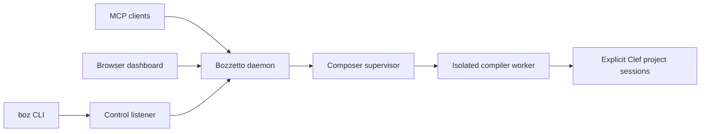

# Bozzetto

**Interactive development coordination for the Fidelity Framework.**

Bozzetto connects editing, compiler evidence and running code across the people and agents working on a Clef project. It hosts explicit Composer project sessions in which edits are reserved before they are made, builds are incremental and native, and execution is admitted only for an artifact the compiler has accepted. MCP clients and the browser work through the same sessions and the same authority.

[Development horizons](docs/Bozzetto_Development_Horizons.md) · [Fidelity component contracts](docs/Bozzetto_Fidelity_Component_Contracts.md) · [Get started](#get-started) · [Documentation](docs/README.md)

## The Name

A *bozzetto* (Italian, pronounced bot-SET-oh) is the small model a sculptor shapes in clay or wax before starting the full work. The word is the diminutive of *bozzo*, "sketch" or "rough stone" ([Merriam-Webster](https://www.merriam-webster.com/dictionary/bozzetto), [Britannica](https://www.britannica.com/art/bozzetto)). A patron sees the bozzetto and asks for changes while a change still costs little.

The model gives an idea enough substance to be judged: proportion, movement and the relationship between parts become visible before the sculptor commits to the finished material. Bozzetto offers the same exchange between making and examining. A definition or a change is tried against a real project, its consequences are shown as compiler evidence and execution, and it is revised while the work is still open, with people and agents inspecting the same work.

The connection to **Atelier** is deliberate. An *atelier* is an artist's workshop, where sketches, models, tools and unfinished pieces are brought together. Atelier is Fidelity's editing and workbench environment: source beside compiler graphs, proof evidence, execution results and debugging views. Bozzetto is its companion, coordinating the shared compiler workspace and execution behind those views through Composer's contracts. Atelier is the place to arrange, edit and inspect the work; Bozzetto keeps the sessions and execution that people and agents rely on coordinated, so no single interface becomes the owner of compiler meaning.

<a id="-one-daemon-every-client"></a>
<a id="how-bozzetto-works"></a>

## How Bozzetto Works

One long-running daemon owns a single Composer supervisor. Every client — MCP agents, the browser dashboard and command-line tools — reaches the same supervisor, which drives an isolated compiler worker holding the live project sessions.



A project is opened explicitly from an absolute `.fidproj` path, and every operation carries the identity of its host, session and compiler epoch:

| Operation | Meaning |
|---|---|
| Open | Create a Composer project session for an explicit project. |
| Reserve | Withdraw the current artifact's run authority before source or dependency edits. |
| Build | Compile the reserved revision and return diagnostics and artifact evidence. |
| Run | Have Composer revalidate inputs and executable bytes, then execute the accepted native artifact. |
| Cancel, close or retire | Withdraw authority and report cleanup; replacing the compiler starts a fresh worker epoch. |

Status and artifact paths are evidence, not permission: execution always passes through Composer's revalidation. Incremental dependency bookkeeping and the lifetimes of explicitly started work are delegated to [Fidelity.FSharp.Incremental](docs/Bozzetto_Incremental_Foundation_Adoption.md), the foundation shared with the Clef/CCS/Baker/Composer pipeline; Bozzetto does not keep a separate invalidation mechanism.

The daemon exposes three surfaces:

- **MCP** (Streamable HTTP on port 47749): the `composer_*` tools and the `composer://sessions` resource.
- **The browser dashboard** (`/dashboard` on 47749): a [Partas.Solid](https://github.com/shayanhabibi/Partas.Solid) application in [`bozzetto-web/`](bozzetto-web/README.md). The page and daemon share one typed vocabulary of commands and events over a single WebSocket bridge. The daemon acts as the update function, and the page's reactive stores fold the events it pushes. The design follows Fidelity's WREN stack, so the same protocol can later be served by a native Clef backend over BAREWire.
- **The control listener** (port 47750): daemon identity and shutdown for `boz status` and `boz stop`. It is a separate listener so that it answers even when the MCP listener has failed.

The host and compiler worker run on .NET. Their contracts are written so that native hosting can replace them without making CLR types, a particular editor or a transport the source of compiler authority. Bozzetto does not host an F# REPL; interactive Clef execution is a Composer backend built on LLVM ORC.

## Development Horizons

| Horizon | Development experience | What it requires |
|---|---|---|
| **H1 — One local compiler workspace** | Editors, MCP clients and the browser share identified source snapshots, compiler evidence and execution state. A CPU REPL uses LLVM ORC JIT, and a native host removes the managed bootstrap. | Compiler parity and repeatable distribution promotion, shared checks and overlays, artifact correspondence, ORC state and callback lifetimes, native host conformance. |
| **H2 — Application code across local and LAN targets** | Select application code for interactive execution in its real context, across CPUs, accelerators and devices, including mobile devices and unified-memory systems. | Selection and effect contracts, named target arithmetic contexts, target-specific deployment, state transfer and honest reload, restart or reprogram behavior. |
| **H3 — Coordinated remote sites** | Authenticated site nodes extend the same workflow to remote accelerators and devices across WAN links. | Site identity and authorization, remote admission and ownership, transfer provenance, cancellation, disconnect recovery and observable execution. |

H1 is the committed local direction. H2 and H3 are exploratory: an implementation tranche for cross-target execution, target numeric semantics or remote sites follows demonstrated demand, a concrete workload and value that justifies its compiler, proof and hardware cost.

H1 begins with one compiler-owned workspace shared across interfaces; editors that open the same path do not thereby share a workspace. CPU ORC execution and the native host are distinct workstreams with their own acceptance evidence.

H2 aims at arbitrary selection: a developer selects useful code wherever it occurs, without first moving it into a pure function or a common module. The compiler identifies the selection's dependencies, captures, effects and target requirements, and either admits the execution with explicit state and lifetime rules or explains the refusal. A selection's **named arithmetic context** belongs to compiler admission and its proof claim; host arithmetic never silently stands in for a target's. Hot module reload reports what actually happened on each target — preserved state, restart, device reprogramming or explicit migration — rather than promising continuity.

H3 carries those rules through authenticated site nodes, keeping ownership and evidence clear when compilation, deployment and execution occur at different sites, including across interrupted WAN connections.

The [horizons document](docs/Bozzetto_Development_Horizons.md) develops these scenarios and gates, and the [development plan](docs/Clef_Composer_Development_Plan.md) orders the first-horizon work.

## Roles in Fidelity

| Component | Responsibility |
|---|---|
| Composer / Clef Compiler Service | Source snapshots, semantic and proof authority, compiler evidence, target-specific build and execution admission. |
| Bozzetto | Workspace and session ownership, worker lifecycle, client routing, work coordination and supervised execution through compiler contracts. |
| Lattice | Language and proof tooling for editors, navigation and linked source/evidence views. |
| Atelier | A development environment presenting the same workspace through its own interaction and rendering choices. |

Bozzetto carries compiler-authored evidence faithfully, with its source, target and revision identity; it never manufactures compiler meaning of its own. The [component contracts](docs/Bozzetto_Fidelity_Component_Contracts.md) set out the wider boundaries.

## Get Started

<a id="installation"></a>

### 1. Install

Bozzetto is distributed as a reviewed release bundle — daemon and Composer worker — launched through the installed `boz` command; it is not published to NuGet. `scripts/ship` gates a commit and pushes it, and the main build promotes the gated bundle. For host development, use the SDK pinned in `global.json` and follow [the contributing guide](CONTRIBUTING.md); building the host does not change the compiler distribution a session runs.

### 2. Start the shared daemon

```bash
scripts/start-shared-daemon
```

The helper leaves an existing daemon in place. A new daemon runs from the dedicated workspace `${XDG_DATA_HOME:-$HOME/.local/share}/bozzetto/workspace` and logs to `${XDG_STATE_HOME:-$HOME/.local/state}/bozzetto/`, independent of any client's lifetime. Inspect it with bounded requests:

```bash
boz status
curl --fail --max-time 3 http://127.0.0.1:47749/api/composer/sessions
```

### 3. Connect

| Interface | Address |
|---|---|
| Browser dashboard | `http://127.0.0.1:47749/dashboard` |
| Streamable HTTP MCP | `http://127.0.0.1:47749/` |
| Composer session resource | `composer://sessions` through MCP |
| Control listener | `http://127.0.0.1:47750/api/daemon-info` |

A connected agent exposes `composer_list_sessions` and `composer_open_project`; see [agent setup](docs/agents.md) and the [MCP reference](docs/mcp-tools.md).

### 4. Open, reserve, build and run

1. Open an absolute `.fidproj` from the dashboard or with `composer_open_project`.
2. Keep the returned host, session and compiler epoch for the operations that follow.
3. Reserve with `composer_reserve_edit` before changing source or dependencies.
4. Make the edit, then pass the single-use reservation to `composer_build`.
5. Inspect the result and execute through `composer_run_current`.

## Repository Layout

| Path | Contents |
|---|---|
| `Bozzetto/` | Daemon supervision, CLI, MCP, control listener and the dashboard bridge. |
| `Bozzetto.Composer/` | The Composer worker and adapter. |
| `Bozzetto.Core/` | Shared and inherited implementation. |
| `bozzetto-web/` | The Partas.Solid dashboard and the shared bridge protocol. |
| `bozzetto-vscode/` | The VS Code extension. |
| `Bozzetto.Tests/`, `Bozzetto.Composer.Tests/` | Test suites. |

The [documentation index](docs/README.md) covers implementation guides, editor references and application samples, including the Raylib window and game demos.

## Contributing

Read [CONTRIBUTING.md](CONTRIBUTING.md) and [AGENTS.md](AGENTS.md) for repository standards and workflows, and use the [horizons](docs/Bozzetto_Development_Horizons.md) and [component contracts](docs/Bozzetto_Fidelity_Component_Contracts.md) to place new work. A proposed capability and its acceptance evidence are distinct; keep them so.

<a id="fork-status"></a>
<a id="hard-fork-lineage"></a>
<a id="acknowledgments"></a>

## Heritage and License

Bozzetto is a hard fork of [SageFs](https://github.com/WillEhrendreich/SageFs), Will Ehrendreich's live F# development daemon. Its persistent REPL, daemon architecture and hot reload engine supplied the working foundation: keep a project alive, try a change and see its effect through shared tools. [Fable.SageFs](https://github.com/shayanhabibi/Fable.SageFs), by Shayan Habibi, brought the Fable compiler into that live session and let its own transforms be revised from the REPL, an example that helped inspire Bozzetto's compiler workbench direction.

Bozzetto carries those ideas into Fidelity's compiler, device and workbench remit. [Upstream heritage](UPSTREAM_HERITAGE.md) records the fork history, original authorship and wider dependency credits.

[MIT license](LICENSE), with the original copyright notice preserved.
