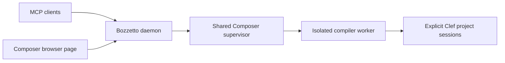

# Bozzetto

**Interactive development coordination for the Fidelity Framework.**

Bozzetto is being built to connect editing, compiler evidence and live application behavior across people and agents. A shared local compiler workspace and CPU REPL are the firm next direction. Interactive development across nearby devices and authenticated remote sites are broader directions to explore as demand is demonstrated.

The working foundation today is an explicit Clef/Composer project session: humans and agents share edit reservations, incremental CPU native builds, accepted-artifact evidence and gated execution through MCP and the browser. Shared editor workspaces, CPU ORC execution, arbitrary application selections and distributed hot module reload (HMR) are development horizons described below.

[Development horizons](docs/Bozzetto_Development_Horizons.md) · [Fidelity component contracts](docs/Bozzetto_Fidelity_Component_Contracts.md) · [Get started](#get-started) · [Documentation](docs/README.md)

## The Name

A *bozzetto* (Italian, pronounced bot-SET-oh) is the small model a sculptor shapes in clay or wax before starting the full work. The word is the diminutive of *bozzo*, which means "sketch" or "rough stone" ([Merriam-Webster](https://www.merriam-webster.com/dictionary/bozzetto), [Britannica](https://www.britannica.com/art/bozzetto)). A patron sees the bozzetto and asks for changes while a change still costs little.

The model gives an idea enough substance to be judged. Proportion, movement and the relationship between parts become visible before the sculptor commits to the finished material. We chose the name for that exchange between making and examining: trying a definition or a change against a real project, seeing its consequences, and revising it while the work is still open. Compiler evidence and interactive execution should make that process available to developers, with people and agents able to inspect the same work.

The connection to **Atelier** is deliberate. An *atelier* is an artist's workshop, the place where sketches, models, tools and unfinished pieces can be brought together. Fidelity's planned Atelier editing and workbench interface should give developers that kind of working space: source beside compiler graphs, proof evidence, execution results and debugging views. Bozzetto is the companion that coordinates the shared compiler workspace and execution behind those views, through Composer's contracts. Atelier provides the place to arrange, edit and inspect the work; Bozzetto keeps the sessions and execution that people and agents are working on coordinated.

That relationship is a design direction, with the current Composer foundation described below. It allows Atelier, other editors, the browser and MCP clients to participate in the same development process without making a particular interface the owner of compiler meaning. As the workbench grows from local CPU experiments toward the broader horizons, the name continues to describe its purpose: give an idea a form that can be examined and changed before committing it to the finished application.

## The Working Foundation

Bozzetto's daemon owns one Composer supervisor shared by MCP tools, the `composer://sessions` resource and the `/composer` browser page. Each project is opened explicitly from an absolute `.fidproj` path. Operations carry host, session and compiler epoch identity.

| Operation | Current behavior |
|---|---|
| Open | Create an explicit Composer project session. |
| Reserve | Withdraw the old artifact's run authority before source or dependency edits. |
| Build | Compile the reserved revision and return diagnostics and artifact evidence. |
| Run | Ask Composer to revalidate inputs and executable bytes, then execute the accepted native artifact. |
| Cancel, close or retire | Withdraw authority and report cleanup; compiler replacement requires a fresh worker epoch. |

The [October 1 promoted-distribution assessment](docs/Bozzetto_Incremental_Workflow_Auditor_Assessment_2026-09-30.md#october-1-promoted-distribution-repeat) records the completed compiler promotion, the full 29-case provider tier and a repeated cold/unchanged/edited native journey. This establishes the bounded scalar workflow; native Lazy/Result boundaries and broader language coverage remain open. Object reuse does not imply proof-result reuse or a measured performance gain.

The reviewed CLI/help deployment and compiler promotion are separate changes, recorded in the [continuation follow-up](docs/Bozzetto_Compiler_Continuation_Followup_2026-09-30.md). A newer checkout or CLI alone does not change the compiler executing a session.

## Development Horizons

H1 is the firm local development direction; **H1 is not complete**. H2 and H3 are exploratory directions, not delivery promises. Before committing an implementation tranche for arbitrary cross-target execution, preservation of target numeric semantics or remote sites, establish demonstrated customer, developer or engineering demand, a concrete workload and the value that justifies the compiler, proof and hardware complexity.

| Horizon | Intended development experience | Work still required |
|---|---|---|
| **H1 — One local compiler workspace** | Editors, MCP clients and the browser share identified source snapshots, compiler evidence and execution state. A CPU REPL uses LLVM ORC JIT; native hosting removes the managed bootstrap requirement. | Broader compiler parity and validated distribution promotion, shared checks and overlays, artifact correspondence, ORC state/callback lifetime, and native host conformance. |
| **H2 — Application code across local and LAN targets** | Select application code for interactive execution in its real context; develop across CPUs, accelerators and devices, including mobile devices and systems with unified memory. | Selection and effect contracts, named target arithmetic contexts, target-specific deployment, state transfer and honest reload/restart/reprogram behavior. |
| **H3 — Coordinated remote sites** | Authenticated site nodes extend the same workflow to remote accelerators and devices across WAN links. | Site identity and authorization, remote admission and ownership, transfer provenance, cancellation, disconnect recovery and observable execution. |

H1 starts with one compiler-owned workspace shared across interfaces. Lattice's current editor session and Bozzetto's Composer project session do not become that workspace merely by opening the same path. CPU ORC execution and a native host are distinct workstreams, each requiring its own acceptance evidence. Compiler parity and repeatable promotion remain prerequisites as language coverage grows; one promoted scalar workflow does not settle those broader gates.

H2's objective remains arbitrary application code selection: let a developer select useful code wherever it occurs in an application. Moving it into a pure function or a Common module is not a prerequisite. The compiler must identify the selection's dependencies, captures, effects and target requirements, and either admit that execution with explicit state and lifetime rules or explain the refusal. Effects remain real application behavior.

A selection's **named arithmetic context** belongs to compiler admission and its proof claim. Choosing CPU-native arithmetic versus preserving another target's arithmetic in ORC can substantially change proof obligations and hardware capability requirements. Host arithmetic must not silently stand in for that target. These distinctions need explicit evaluation across heterogeneous CPUs and accelerators, mobile devices and systems with unified memory; shared memory alone does not settle code, state or synchronization contracts.

HMR should describe what actually happened on each target. A compatible update may preserve a running application's state; another change may require restart, device reprogramming or explicit state migration. Those outcomes must stay visible. Continuous execution is a capability to establish for a particular target and change, not a promise implied by calling every update HMR.

H3 would extend those rules through authenticated site nodes, retaining clear ownership and evidence when compilation, deployment and execution occur at different sites, including during interrupted WAN connections. No remote-site API or distributed execution capability is delivered by today's local provider.

The [horizons document](docs/Bozzetto_Development_Horizons.md) develops these scenarios and gates. The [near-term implementation plan](docs/Clef_Composer_Development_Plan.md) orders the current compiler/workspace work.

## Roles in Fidelity

The intended component contracts keep compiler meaning, interaction and execution coordination distinct:

| Component | Responsibility |
|---|---|
| Composer / Clef Compiler Service | Source snapshots, semantic and proof authority, compiler evidence, target-specific build and execution admission. |
| Bozzetto | Selected workspace and session ownership, worker lifecycle, client routing, work coordination and supervised execution through compiler contracts. |
| Lattice | Language and proof tooling for editors, navigation and linked source/evidence views. |
| Atelier | A development environment presenting the same workspace through its own interaction and rendering choices. |

These responsibilities guide integration; they do not claim that every client already shares one workspace. Bozzetto must carry compiler-authored evidence faithfully, including its source, target and revision identity. See the [Fidelity component contracts](docs/Bozzetto_Fidelity_Component_Contracts.md) for the wider boundaries and outstanding decisions.

## Get Started

### 1. Use the reviewed installation

<a id="installation"></a>

The [live provider checkpoint](docs/Bozzetto_Live_Provider_Checkpoint_2026-09-30.md) documents the launcher, runtime and connection setup. Read its [deployment correction](docs/Bozzetto_Live_Provider_Audit_Response_2026-09-30.md) and the [October 1 promotion](docs/Bozzetto_Incremental_Workflow_Auditor_Assessment_2026-09-30.md#october-1-promoted-distribution-repeat) for subsequent deployment identities. No Bozzetto package is published to NuGet.

For host development, use the SDK pinned in `global.json` and follow [the contributing guide](CONTRIBUTING.md). Building or packaging the host alone does not configure or promote a Composer distribution.

### 2. Connect to the shared daemon

From this checkout:

```bash
scripts/start-shared-daemon
```

The helper preserves an existing listener. New daemons use the installed `boz`, the dedicated external workspace `${XDG_DATA_HOME:-$HOME/.local/share}/bozzetto/workspace`, and logs under `${XDG_STATE_HOME:-$HOME/.local/state}/bozzetto/`. Keep the shared daemon independent of any individual MCP client's lifetime.

Inspect daemon and provider state with bounded requests:

```bash
boz status
curl --fail --max-time 3 http://127.0.0.1:47749/health
curl --fail --max-time 3 http://127.0.0.1:47749/api/composer/sessions
```

### 3. Open the browser or connect MCP

| Interface | Address |
|---|---|
| Composer browser page | `http://127.0.0.1:47749/composer` |
| Streamable HTTP MCP | `http://127.0.0.1:47749/` |
| Dashboard | `http://127.0.0.1:47750/` |
| Composer session resource | `composer://sessions` through MCP |

Confirm that your connected agent exposes `composer_list_sessions` and `composer_open_project`. See [agent setup](docs/agents.md) and the [MCP reference](docs/mcp-tools.md); a configuration entry alone does not establish a live connection.

### 4. Open, reserve, build and run

1. Open an absolute `.fidproj` using the browser or `composer_open_project`.
2. Retain the returned host, session and compiler epoch for subsequent operations.
3. Call `composer_reserve_edit` and receive success before changing source or dependencies.
4. Make the edit, then pass the single-use reservation to `composer_build`.
5. Inspect the result and execute through `composer_run_current`.

The browser uses the same authority. An edit reservation, cancellation or worker retirement withdraws prior run authority. Status and artifact paths are evidence; execution always passes through Composer's revalidation gate.

## Current Host Structure

<a id="-one-daemon-every-client"></a>
<a id="how-bozzetto-works"></a>



The host and compiler worker use .NET today. Their public contracts should support the native hosting horizon without making CLR types, a particular editor or a transport the source of compiler authority.

`Bozzetto/` contains daemon supervision, CLI, MCP and browser routes; `Bozzetto.Composer/` contains the worker and adapter. `Bozzetto.Core/` holds shared and inherited implementation. Tests live in `Bozzetto.Tests/` and `Bozzetto.Composer.Tests/`. The [Clefx host transition](docs/Bozzetto_Clefx_Host_Transition_2026-10-01.md) removes embedded production FSI hosting from this checkout and directs F# work to separate SageFS; a real Clef interactive host remains future work.

The [documentation index](docs/README.md) retains implementation and compatibility guides, editor references and application samples, including the Raylib window and game demos.

## Contributing

Read [CONTRIBUTING.md](CONTRIBUTING.md) and [AGENTS.md](AGENTS.md) for repository standards and implementation workflows. Use the [horizons](docs/Bozzetto_Development_Horizons.md) and [component contracts](docs/Bozzetto_Fidelity_Component_Contracts.md) to place new work, and preserve the distinction between a proposed capability and its executed acceptance evidence.

## Heritage and License

<a id="fork-status"></a>
<a id="hard-fork-lineage"></a>
<a id="acknowledgments"></a>

Bozzetto is a hard fork of [SageFs](https://github.com/WillEhrendreich/SageFs), Will Ehrendreich's live F# development daemon. Its persistent REPL, daemon architecture and hot reload engine supplied the working foundation: keep a project alive, try a change and see its effect through shared tools. [Fable.SageFs](https://github.com/shayanhabibi/Fable.SageFs), by Shayan Habibi, brought the Fable compiler into that live session and allowed its own transforms to be revised from the REPL. That example helped inspire Bozzetto's compiler workbench direction.

Bozzetto carries those ideas into Fidelity's broader compiler, device and workbench remit. Today's Composer integration uses explicit worker retirement and replacement; live compiler patching and Clef ORC execution remain separate work. F#/.NET development uses the independent SageFS service on `37749`/`37750`, alongside Bozzetto on `47749`/`47750`. [Upstream heritage](UPSTREAM_HERITAGE.md) records the fork history, original authorship and wider dependency credits.

[MIT license](LICENSE), with the original copyright notice preserved.
