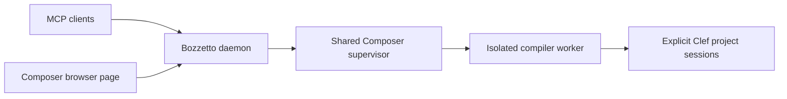

# Bozzetto

**Clef/Composer incremental development with one session view for humans and agents.**

Bozzetto hosts Composer sessions behind shared MCP tools and a browser interface:
explicit project opening, edit reservations, native builds, artifact evidence,
cancellation, gated execution and compiler-worker replacement. Use the
[live checkpoint](docs/Bozzetto_Live_Provider_Checkpoint_2026-09-30.md) for the
reviewed local installation, startup, MCP connection and acceptance status.

The destination is a Clef REPL backed by LLVM ORC JIT. Today's provider executes
accepted native binaries; ORC integration remains planned. The host is currently
.NET-based. F#/.NET work can use a separate SageFS daemon and MCP connection on
its own ports. The inherited F# engine remains in this fork while the
[development plan](docs/Clef_Composer_Development_Plan.md) establishes Bozzetto's
compiler-focused identity and self-hosting boundaries.

[](LICENSE)

---

## The Name

A *bozzetto* (Italian, pronounced bot-SET-oh) is the small model a sculptor shapes in clay or wax before starting the full work. The word is the diminutive of *bozzo*, which means "sketch" or "rough stone" ([Merriam-Webster](https://www.merriam-webster.com/dictionary/bozzetto), [Britannica](https://www.britannica.com/art/bozzetto)). A patron sees the bozzetto and asks for changes while a change still costs little.

We chose the name for that working relationship. In a Bozzetto session a definition is evaluated against the live project, judged on its result and revised before a full release build.

## Toolchain Constellation

In the Fidelity Framework the Clef Compiler Service (CCS) is the single semantic authority. It publishes the Program Semantic Graph, and three tools are designed to present that graph to the developer.

| Tool | Role |
|---|---|
| Lattice | The language server and its editor clients. Lattice carries editing requests and presents compiler results in the editor. |
| Atelier | The development environment. Atelier presents the graph, the proofs and the debugging views in panes. |
| Bozzetto | The session hub. Bozzetto hosts Composer project sessions, reserves edits, builds revisions and runs accepted native artifacts. The browser and AI agents share the same session state. |

Bozzetto now exposes explicit Clef/Composer sessions; F#/.NET development can remain on the separate SageFS service. We are designing its Clef side to read graph revisions from CCS through the same published contract that Lattice and Atelier use. The [Lattice integration plan](https://github.com/FidelityFramework/Composer/blob/main/docs/Lattice_Integration.md) and the [interactive compiler workbench](https://github.com/FidelityFramework/Composer/blob/main/docs/Interactive_Compiler_Workbench.md) describe the shared service.

## Hard-Fork Lineage

We build the framework's tooling by hard-forking several F# tools. Lattice is a hard fork of [Ionide](https://ionide.io/), and Bozzetto a hard fork of [SageFs](https://github.com/WillEhrendreich/SageFs).

SageFs is the live F# development daemon created by Will Ehrendreich. The daemon architecture and the hot reload engine in this repository originate from his work.

[Fable.SageFs](https://github.com/shayanhabibi/Fable.SageFs), by Shayan Habibi, runs the Fable compiler inside a SageFs session and patches the compiler's own transforms from the REPL. It showed us a compiler hosted and revised inside a live session. We intend the same use for CCS and Composer in Bozzetto.

[UPSTREAM_HERITAGE.md](UPSTREAM_HERITAGE.md) records the fork point and the credits in full.

## Hosting Trajectory

The Fidelity Framework compiler is .NET-hosted today. CCS and Composer are F# programs that run on the .NET runtime and produce native code. Bozzetto also uses .NET today; removing that runtime requirement is an explicit self-hosting objective.

Bozzetto's delivery priority is Clef/Composer development. F#/.NET development can use a separate SageFS daemon and MCP connection on ports `37749`/`37750`, alongside Bozzetto on `47749`/`47750`. The inherited F# engine remains in this checkout, but expanding it is not required for the Clef workflow.

Bozzetto now integrates Composer's bounded [incremental project session](https://forge.spkez.dev/FidelityFramework/Composer/src/branch/main/docs/Incremental_Project_Sessions.md) for CPU `.fidproj` compilation through an isolated compiler worker. Nine `composer_*` MCP tools, the `composer://sessions` resource and the `/composer` browser page use one daemon-owned supervisor. They share project opening, edit reservations, native builds, accepted-artifact evidence, cancellation and gated execution. Clef projects are opened explicitly and never passed to the inherited FSI loader.

Each session carries provider, host, session, epoch and revision identity. Reservations withdraw old execution authority before edits; execution goes through Composer's `RunCurrentAsync`. Worker retirement fences every owned session and requires physical process exit before a replacement epoch can serve work. Patching a running compiler worker in place is unsupported. Every build retains Baker checking and the full current proof checks; eligible scalar functions can reuse Alex witnesses and native objects.

The shared MCP/browser journey and native worker cases passed the unfiltered **29/29 Composer integration tier (Trusted)**. The [live checkpoint](docs/Bozzetto_Live_Provider_Checkpoint_2026-09-30.md) records deployment, exact evidence and the separate default gate; the [incremental workflow assessment](docs/Bozzetto_Incremental_Workflow_Auditor_Assessment_2026-09-30.md) records the independent native journey. The [development plan](docs/Clef_Composer_Development_Plan.md) keeps standalone Composer MCP, editor save/build integration, LLVM ORC JIT and removal of the .NET backend as follow-up work. Today's execution backend launches accepted native binaries; preserving live native state through ORC needs a separate contract and acceptance evidence.

The six waypoints distinguish delivered foundations from remaining work:

1. **Independent identity.** This checkout uses package `Bozzetto`, command `boz`, state directory `~/.bozzetto`, MCP port `47749` and dashboard port `47750`. SageFs and Fable.SageFs retain their separate identities and default ports `37749`/`37750`.
2. **Embedded storage.** SQLite and DuckDB remain the fork's planned storage direction. The updated upstream already removed PostgreSQL in favor of binary session/test manifests and uses SQLite for friction reports; Docker is no longer a runtime prerequisite.
3. **A Clef provider.** Explicit Composer sessions now share daemon-owned state through MCP and the browser. Reading CCS graph revisions through a shared BAREWire layout remains planned.
4. **One compiler epoch.** Worker retirement now withdraws all affected session authority before replacement. Automatically coordinating compiler-source edits with that fence remains planned.
5. **Clef reload.** CCS will identify the changed regions of the graph. Composer will rebuild those segments, and the running program will be relinked or patched through the LLVM ORC JIT for a near-real-time REPL/HMR (hot module reload) experience.
6. **Self-hosting.** Replace the managed compiler worker and daemon dependencies behind the existing session authority contract. A Clef-only installation without .NET is the exit criterion; separate SageFS instances can continue serving F#/Fable projects.

## Fork Status

- Original fork: SageFs `5b685fb5ce3f5a90db595b457dee6d239634ba33` (23 February 2026).
- Integrated upstream baseline: SageFs **v0.6.834**, `c86c3402460543849e771e527aa75b5892770ea0` (25 September 2026), integrated on 27 September 2026. [Update record](docs/UPSTREAM_SYNC.md).
- Executables, packages, namespaces, editor commands, state paths and default ports use the Bozzetto identity. [Identity migration checkpoint](docs/Bozzetto_Identity_Migration_Inventory.md) records the exact names, provenance exceptions and validation scope.
- No Bozzetto package is published. [Installation](#installation) uses the reviewed local deployment; installing `SageFs` from NuGet installs upstream instead. We may use the Fidelity package manager rather than publish a Bozzetto NuGet package.
- Shared Clef/Composer MCP and browser sessions, native compilation/execution and compiler-worker epoch retirement are delivered; the [live checkpoint](docs/Bozzetto_Live_Provider_Checkpoint_2026-09-30.md) and [independent assessment](docs/Bozzetto_Incremental_Workflow_Auditor_Assessment_2026-09-30.md) record their acceptance scope. Standalone Composer MCP, shared PSG views, ORC reload and self-hosting remain planned. Retained F# references are listed separately below.
- Current clients are VS Code, Neovim, the web dashboard, and MCP. The built-in TUI, Raylib GUI, and Visual Studio extension are deprecated upstream. Raylib application demos remain separate supported examples.
- Current guides use Bozzetto terminology. Historical records, upstream attribution and real third-party package/plugin names retain their original identities.

---

## Key Features

- **Explicit Clef projects:** open an absolute `.fidproj` path in Composer through MCP or the browser.
- **Shared session state:** humans and agents see the same project, compiler epoch, revision and accepted-artifact evidence.
- **Reserved edits:** reserve before changing source or dependencies; the reservation withdraws authority to run the old artifact.
- **Incremental native builds:** build the reserved revision through Composer and inspect compiler diagnostics and reuse evidence.
- **Gated execution:** run the accepted revision through `composer_run_current`, which revalidates its inputs and executable bytes.
- **Worker lifecycle:** cancel work, close sessions and retire the compiler worker before replacing its distribution.

The [independent incremental workflow assessment](docs/Bozzetto_Incremental_Workflow_Auditor_Assessment_2026-09-30.md) records a cold build, unchanged rebuild and one-function edit against the pinned compiler. A compiler checkout build does not update that deployed distribution.

## Get Started

### 1. Use the reviewed installation

<a id="installation"></a>

The [live provider checkpoint](docs/Bozzetto_Live_Provider_Checkpoint_2026-09-30.md) and its [deployment correction](docs/Bozzetto_Live_Provider_Audit_Response_2026-09-30.md) identify the installed `boz` launcher, matching runtime, Composer worker and approved compiler distribution. Use that installation for the shared workflow. No Bozzetto package is published to NuGet.

For development of the managed host, follow [the contributing guide](CONTRIBUTING.md) and use the SDK pinned in `global.json`. Building or packaging the host alone does not configure a Composer worker or promote a compiler distribution.

### 2. Connect to the shared daemon

From this checkout:

```bash
scripts/start-shared-daemon
```

The helper preserves an existing listener. If it launches a daemon, it uses the installed `boz`, a dedicated external workspace at `${XDG_DATA_HOME:-$HOME/.local/share}/bozzetto/workspace`, and logs under `${XDG_STATE_HOME:-$HOME/.local/state}/bozzetto/`. Keep the shared daemon independent of an individual MCP client's lifetime.

Inspect the daemon and provider with bounded requests:

```bash
boz status
curl --fail --max-time 3 http://127.0.0.1:47749/health
curl --fail --max-time 3 http://127.0.0.1:47749/api/composer/sessions
```

### 3. Open the Composer page or connect MCP

| Interface | Address |
|---|---|
| Composer browser page | `http://127.0.0.1:47749/composer` |
| Streamable HTTP MCP | `http://127.0.0.1:47749/` |
| Dashboard | `http://127.0.0.1:47750/` |
| Shared Composer session resource | `composer://sessions` through MCP |

An agent should expose `composer_list_sessions` and `composer_open_project` after connecting. See [AI agent setup](docs/agents.md) and the [MCP reference](docs/mcp-tools.md). A configured server entry alone does not establish a live tool connection.

### 4. Open, reserve, build and run

1. Open an absolute `.fidproj` path using the Composer page or `composer_open_project`.
2. Retain the returned host, session and compiler epoch. Use them for subsequent operations.
3. Call `composer_reserve_edit` and receive a successful reservation before changing source or dependencies.
4. Make the edit, then pass that single-use reservation to `composer_build`.
5. Inspect the build result and run through `composer_run_current`.

The browser presents the same operations and authority. A new edit reservation, cancellation or worker retirement withdraws the prior run authority. Status and artifact paths are evidence; execution always goes back through Composer's revalidation gate.

Today's backend runs accepted native binaries. LLVM ORC JIT, live native-state preservation and automatic editor save/build integration remain in the [development plan](docs/Clef_Composer_Development_Plan.md).

## How Bozzetto Works

<a id="-one-daemon-every-client"></a>



The daemon owns the Composer supervisor. MCP tools, the session resource and the browser/API share its session directory. The worker carries compiler identity and session authority across each operation. Replacing that worker requires retirement of its existing epoch; new work then uses a fresh epoch.

F#/.NET development uses a separate SageFS service: MCP on `37749`, dashboard on `37750`. Its sessions and lifecycle are independent of Bozzetto's `47749`/`47750` endpoints.

## Retained F# References

The inherited F# engine and editor integrations remain available as compatibility and implementation code. Their guides describe that engine; Composer projects use the workflow above.

- [Workflow modes](docs/workflow-modes.md), [hot reload](docs/hot-reload.md) and [live testing](docs/live-testing-as-you-type.md)
- [Editor feature matrix](docs/FEATURE_MATRIX.md), [VS Code setup](bozzetto-vscode/README.md) and [Neovim plugin](https://github.com/WillEhrendreich/sagefs.nvim)
- [F# implementation skill](skills/bozzetto/SKILL.md), [session isolation](docs/session-isolation.md) and [troubleshooting](docs/TROUBLESHOOTING.md)
- [Samples](samples/README.md), including the [Raylib window](samples/demos/raylib-hello.fsx) and [game](samples/demos/raylib-game.fsx) demos; these are application examples, separate from the deprecated Raylib frontend

## Repository Map

- `Bozzetto/`: CLI, daemon, shared Composer supervisor, MCP tools and browser routes
- `Bozzetto.Composer/`: isolated Composer worker, provider contracts and session adapter
- `Bozzetto.Core/`: shared engine, retained F# runtime logic, testing and persistence
- `Bozzetto.Host/`, `Bozzetto.FsiHost/`: retained F# worker and isolated FSI host
- `Bozzetto.Tests/`, `Bozzetto.Composer.Tests/`: test suites
- `bozzetto-vscode/`: retained editor integration
- `docs/`: user guides, architecture, deployment and acceptance records
- `scripts/`: startup, release and validation helpers
- `samples/`: retained runnable applications and language examples

See the [documentation index](docs/README.md) for current Composer guidance and retained technical references.

## Contributing

Bozzetto is open source, and contributions are welcome: bug fixes, documentation improvements, new tests, or whole features. PRs are encouraged.

**→ [Read the Contributing Guide](CONTRIBUTING.md)** for setup instructions, debugging workflow, coding standards, and how to make your first PR.

New to the codebase? Check the **Good First Contributions** section in the contributing guide for places where help is especially welcome.

## License

[MIT](LICENSE)

## Acknowledgments

- [SageFs](https://github.com/WillEhrendreich/SageFs), by Will Ehrendreich: the project Bozzetto is forked from. See [UPSTREAM_HERITAGE.md](UPSTREAM_HERITAGE.md).
- [Fable.SageFs](https://github.com/shayanhabibi/Fable.SageFs), by Shayan Habibi: the Fable compiler hosted live in a SageFs session.
- [FsiX](https://github.com/soweli-p/FsiX): the original F# Interactive experience that inspired Bozzetto
- [sagefs.nvim](https://github.com/WillEhrendreich/sagefs.nvim): upstream Neovim plugin (separate repository; configure ports `47749`/`47750` to connect to Bozzetto)
- [Falco](https://github.com/pimbrouwers/Falco) and [Falco.Datastar](https://github.com/spiraloss/Falco.Datastar): dashboard framework
- [Harmony](https://github.com/pardeike/Harmony): runtime method patching for hot reload
- [Ionide.ProjInfo](https://github.com/ionide/proj-info/): project file parsing
- [Raylib-cs](https://github.com/ChrisDill/Raylib-cs): graphics and game demos
- [Fable](https://fable.io/): F# to JavaScript compiler (the VS Code extension is compiled with it)
- [ModelContextProtocol](https://modelcontextprotocol.io/): AI integration standard

Upstream also credits Jo Van Eyck's [fsi-mcp-server](https://github.com/jovaneyck/fsi-mcp-server) for demonstrating FSI access through MCP.
