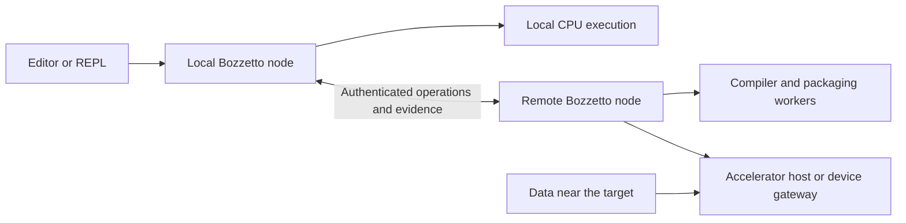

# Bozzetto development horizons

October 1, 2026. This document defines Bozzetto's product direction and the
acceptance boundaries for three horizons. It is written for framework developers,
tool authors and application developers. The horizons are an ordering of
capabilities, not release dates or a claim that the described interfaces exist.
Second- and third-horizon scope is exploratory. In particular, executing arbitrary
target code on a CPU while preserving the target's semantics requires demonstrated
customer, developer or engineering demand before an implementation commitment.

Bozzetto coordinates interactive development across the Fidelity Framework:
compiler workspaces, REPL execution, application updates, physical targets and,
eventually, remote execution sites. Editors, browser clients and agents should
work against the same source and execution evidence. The CPU REPL is the first
interactive execution experience; the broader destination includes controlled
updates and inspection of applications spanning different processors and hosts.

Read the [component contracts](Bozzetto_Fidelity_Component_Contracts.md) for the
interfaces this direction requires. The [Clef and Composer development plan](Clef_Composer_Development_Plan.md)
remains the detailed plan for the local provider and first-horizon integration.
The [editor workspace direction](Bozzetto_Editor_Workspace_Direction_2026-09-30.md)
owns the existing shared workspace, overlay and observation requirements.

## Current foundation and planned scope

| Horizon | Developer outcome | Status at this checkpoint |
|---|---|---|
| First | Develop Clef applications through a shared local compiler workspace, inspect evidence, and use a CPU REPL with defined state and code lifetimes. | Explicit Composer CPU project sessions, reservations, native build/run and worker retirement have recorded acceptance. Shared editor authority, native REPL and removal of managed hosting dependencies remain work. |
| Second | Select ordinary application code for interactive execution, explore preservation of target semantics, and update applications on local or LAN-connected heterogeneous targets. | Candidate scope, selected by demand and feasibility. Cross-target evaluation requires a separate investment decision; target adapters and lifecycle work can progress independently. |
| Third | Coordinate the same development operations across authenticated Bozzetto nodes at different sites, including remote specialized processors. | Exploratory direction. Requires a demonstrated remote workflow plus remote authority, operation reconciliation and resource admission. |

The [October 1 promoted-distribution journey](Bozzetto_Incremental_Workflow_Auditor_Assessment_2026-09-30.md#october-1-promoted-distribution-repeat)
is the latest recorded native workflow here. It establishes the bounded scalar
journey and reuse against that distribution; it does not establish full Clef,
sample-oracle or unit-test parity. The [continuation follow-up](Bozzetto_Compiler_Continuation_Followup_2026-09-30.md)
separates compiler promotion, CLI deployment and remaining integration work.
These records are evidence, not a promise that a later checkout or deployment has
the same identity or capabilities.

## First horizon local development

The initial product should let a developer open a real project, attach an editor
and an agent to its compiler workspace, edit it, inspect current diagnostics and
artifacts, and execute the accepted revision. CPU interactive execution extends
that workspace with arguments, values and persistent state under compiler-owned
rules. Its acceptance must cover more than repeated launches of a native binary.

Bozzetto should provide:

- One explicitly owned workspace per selected session, shared through MCP,
  browser and editor adapters. Saved inputs, unsaved overlays, compiler
  generations and accepted artifacts retain their distinct identities.
- Ordered edit admission, build and execution. A reservation withdraws permission
  for new execution of the previous accepted revision before a source write.
  Already-running frames and effects have separate lifetime rules.
- Compiler-produced diagnostics, proof observations, source correspondence and
  artifact inventories. Reading existing evidence does not start hidden builds
  or create a second checker in the client.
- CPU REPL operations through Composer's native interactive service and intended
  LLVM ORC backend: invocation, typed result inspection, redefinition,
  initialization, captured state and code retirement. Unsupported forms report
  their actual missing compiler capability.
- Explicit process boundaries, compiler-state serialization, bounded queues,
  solver concurrency and cancellation. The native/pthread host must preserve
  these contracts when it replaces managed infrastructure.
- Adoption of Fidelity.FSharp.Incremental for shared dependency bookkeeping,
  demand and explicitly started work in the interim .NET host, coordinated with
  Clef/CCS/Baker/Composer. Its portable core and replaceable host support the
  self-hosting path; compiler proof and execution admission remain authoritative.
- Distribution identification, compatibility checks and coordinated compiler
  replacement. Publishing a CLI, promoting a compiler and replacing application
  code are different operations with different owners and evidence.

Compiler parity remains a compiler-owned prerequisite for broad acceptance:
recover the pre-rearchitecture language behavior, runnable sample oracles and
supported unit suites, recording actual execution and remaining gaps. Bozzetto
must not fill a language gap with an F# surrogate or count a narrower demonstration
as parity. Bounded integration can proceed while the compiler owner restores that
baseline. Each promoted distribution receives its own Bozzetto acceptance journey.

Native hosting is a first-horizon engineering workstream, not something deferred
until federation. ORC and the managed-to-native host migration can progress
independently. Portable contracts must avoid CLR object identities, FSI and
reflection requirements; a Clef-only installation without .NET remains the host
migration exit criterion.

The [incremental foundation adoption contract](Bozzetto_Incremental_Foundation_Adoption.md)
sets the near-term integration sequence and lifetime/conformance gates. This is
an H1 adoption direction, not a claim that the new library is already integrated
or that later cross-target execution work has been approved.

### First horizon acceptance

1. Record the compiler-owned parity inventory and distribution identity separately
   from the provider's own acceptance. Repeat reserve/build/run/reuse against the
   exact promoted closure.
2. Demonstrate editor, browser and MCP agreement on the same workspace, including
   invalid edits, conflicting overlays, stale replies and compiler replacement.
3. Exercise real native interactive execution with redefinition, initialization,
   retained closures/callbacks, failed materialization and retirement after the
   final live reference. Compare admitted behavior with a fresh reference build.
4. Measure edit-to-diagnostic, proof completion and code-ready latency separately,
   including queue depth, cancellation and resource use under sustained edits.
5. Run required unfiltered acceptance suites with reported counts. Establish
   equivalent lifecycle behavior on the native host before claiming .NET-free
   deployment.

## Second horizon application code and physical targets

### Interactive execution of ordinary application code

The objective is arbitrary application code selection. A developer should be able
to select a function, expression or compiler-supported region in the existing
application and request interactive execution without moving it into a `Common`
module, rewriting it as a pure helper or creating a separate REPL application.
This is the scope to investigate, not a commitment to implement every execution
mode. A first-horizon CPU REPL and execution on an actual target do not depend on
completing CPU models of other processors.

The compiler constructs an evaluation context from the selected source: lexical
bindings, dependencies, captures, initialization, effects, resource requirements
and target constraints. Some selections need arguments or existing state; a region
may need a compiler-defined callable boundary to preserve its control flow. The
workbench exposes these requirements and the available ways to satisfy them.
Arbitrary selection is the scope of the interface, not an assertion that every
hardware operation can execute on every host.

Consider a GPU function inside an application that reads a device buffer, captures
configuration and calls private helpers. Selecting it should retain those source
relationships. The developer could supply recorded buffer contents and an
identified configuration for a CPU run, or select actual resources for execution
on the GPU. Supplied data and substituted resources must be visible in the result's
provenance. Live state capture needs a valid snapshot boundary; reading mutable
device memory at an arbitrary instant does not establish one.

The execution request and result must distinguish these modes:

| Mode | Meaning of the evidence |
|---|---|
| CPU realization | Observed behavior of the selected source with its admitted CPU representation and supplied context. |
| CPU execution preserving selected target semantics | Observed behavior under named target arithmetic and operation rules, within the explicitly supported model. |
| Simulator or emulator execution | Observed behavior of the identified artifact under a named model and configuration, with its known scope. |
| Physical target execution | Observed behavior of the identified artifact and resources on the selected device and runtime instance. |

None of these results silently becomes evidence for another mode. Preview does
not establish device timing, synchronization, peripherals or resource transfers.
If an operation cannot be represented locally, the compiler can require a real
target, an explicit model or missing context. It must not invent a successful stub.
General processor virtualization is not a prerequisite to begin this work.

### Numeric behavior across targets

The evaluation context identifies the arithmetic contract, including selected
representations, intermediate widths, scale, rounding sites, overflow rules and
permitted accumulation order. A CPU implementation preserving MCU fixed-point
behavior must preserve intermediate operations; converting a floating-point
answer at the end is insufficient. Using a more accurate host representation can
also change behavior that the program explicitly specified.

Clef's [numeric selection contract](../../clef-lang-spec/spec/numeric-selection.md)
already distinguishes native, emulated and unavailable representations. Composer's
[numeric validation cases](../../Composer/docs/PRDs/Numeric_Validation_Cases.md)
require evidence for rounding order, target modes and interactive invalidation.
These define obligations, not completed preview support. Compiler-produced
selection and evidence belong in the workspace; Bozzetto must not implement a
parallel numeric inference system.

Changing from a target realization to CPU-native arithmetic can substantially
change the proof obligations, representation/layout facts and admitted operation
graph. Preserving the target arithmetic on a CPU creates a different compilation
and preservation problem again. Hardware differences add premises about memory,
atomic operations, synchronization and available instructions. This is not a
display option on an existing proof or a promise that the same solver queries can
be reused unchanged.

Each realization needs an identified proof context. The compiler determines which
facts and proofs survive through complete dependency evidence, which need to be
regenerated and which remain unsupported. For a CPU model of a target operation,
the desired target semantics and the CPU's actual capabilities remain separate;
an explicit correspondence obligation connects them. Model evidence never
establishes physical-target timing or device effects. The
[proof context contract](Bozzetto_Fidelity_Component_Contracts.md#proof-contexts-across-realizations)
sets out this boundary.

HelloWayland offers an initial fixture through its [fixed-point computation](../../HelloWayland/src/Common/Fixed.clef)
and [GPU entry](../../HelloWayland/src/Gpu/Kernel.clef). Its existing `Common`
organization does not satisfy the arbitrary-selection objective. Acceptance must
also select code in an ordinary application's existing structure with real
captures, effects and resource requirements. Its [recorded transport discrepancy](../../HelloWayland/docs/shadow-and-substrate.md)
is a useful regression: shared computation still needs complete, correct input
transfer to the device.

### Updating heterogeneous applications

Incremental compilation produces changed artifacts. Hot module reload additionally
requires a valid transition of the running application, its state and resources.
Bozzetto should coordinate that transition across the targets an application uses.

The target adapter declares which operations are available: replacement while
running, replacement after work drains, state migration, process restart, device
reset or reprogramming. These are different developer-visible outcomes. A target
that requires restart must report it; a restart is not a successful claim of
continuous state-preserving HMR. Support grows per target and transition mode.

An application revision can include a CPU host, GPU kernels, NPU programs or
models, and device firmware or FPGA images. Composer supplies the compatible
artifact set and interfaces. Unchanged artifacts may remain in that set if their
dependencies and interfaces remain valid. Matching revision numbers are neither
necessary nor sufficient for compatibility.

The transition plan covers validation, staging where supported, resource
acquisition, a safe activation boundary, state preservation or migration, and
retirement after the final user. Activation may be coordinated without being
globally instantaneous. Partial activation, an unavailable device and failed
migration must produce explicit recovery state; rollback is promised only where
the target can actually perform it.

UMA requires explicit ownership and visibility. For an AMD APU application, a CPU
layout change must not race an old GPU kernel still using the shared buffer. NPU
programs, imports and completion rules need their own adapter evidence. Shared
physical memory alone does not establish addressability, coherence or permission
for each participant. Use the [platform handoff contracts](../../Fidelity.Platform/docs/ADMISSION_AND_SIDECARS.md)
and BAREWire declarations rather than inferring these properties from the APU name.

### Mobile devices and LAN hosts

Compilation target, execution environment, build host and device host are separate
selections. A simulator is its own destination and artifact environment; selecting
physical hardware does not make the simulator forward the same binary to it.
Bozzetto should support these proposed arrangements:

| Workstation | Toolchain host | Execution destination |
|---|---|---|
| Linux | Local or remote host appropriate to the target | Local emulator or directly attached device |
| Linux | LAN-attached M1 running the necessary Apple tooling | Apple simulator or iPhone/iPad reached by the Mac |
| Linux | LAN-attached M1 for Apple toolchain operations | iPhone attached directly to Linux, using a validated Linux device adapter |

Apple's [Xcode requirements](https://developer.apple.com/xcode/system-requirements/)
and [device workflow](https://developer.apple.com/documentation/xcode/running-your-app-on-simulated-or-physical-devices)
define the supported Apple toolchain route. Linux tools such as
[ideviceinstaller](https://github.com/libimobiledevice/ideviceinstaller) and
[pymobiledevice3](https://github.com/doronz88/pymobiledevice3) provide device
installation and developer operations; they do not establish full Xcode parity
or remove signing, provisioning and Developer Mode requirements. Device/iOS/tool
combinations require their own acceptance. Initial support should establish signed
install/launch/observe and report the actual update mode. Desktop ORC behavior
must not be assumed available on an iPhone.

### Second horizon acceptance

The following are acceptance requirements for capabilities selected for delivery
after the demand gate below. They are not a commitment to the whole tranche.

1. Select code from an existing application without source relocation. Exercise
   dependencies, captures, initialization, missing context and an effectful case;
   pure shared helpers alone cannot close this gate.
2. Run recorded inputs under named CPU and target arithmetic contexts. Compare
   using the declared exact or bounded-error relation and include cases that
   distinguish rounding, overflow and accumulation behavior.
3. Update a real CPU/GPU application while old work still holds code or buffers.
   Demonstrate compatible reuse, required invalidation and delayed retirement.
4. Exercise a target requiring restart or reprogramming, with truthful state-loss
   and recovery reporting. Record compile, transfer, load and interruption times
   separately; near-real-time behavior is a measured target result.
5. Exercise the selected mobile topology and independent build/device hosts.
   Include disconnect, device reset and loss of deployment authority.

## Third horizon remote execution sites

A Bozzetto node at a remote site should coordinate that site's compiler workers,
execution hosts and devices. A developer could invoke a selected function on a
remote specialized processor, inspect the result locally, edit the application
and request a controlled update. Nodes belong on suitable hosts or gateways;
every MCU or FPGA does not need to run a Bozzetto daemon.

This is a proposed topology. Today's loopback service and local worker pipes are
not a remote execution protocol. Host enrollment, authorization, protocol
compatibility and resource admission must precede remote execution. LAN reachability
alone grants no authority.

Each workspace has an explicit compiler owner. Forwarding to that owner and
creating an independent workspace are different operations. Nodes exchange
identified source snapshots, artifacts and evidence; they must not silently open
another checker and present its state as the same session. Build hosts, execution
hosts and devices retain distinct identities even when colocated.

Remote operations need durable identities, target-enforced ownership, bounded
queues and reconnection reconciliation. A lost reply can leave an installation
complete or an application still running. Retrying must not blindly duplicate
effects. The owner reports whether cancellation was requested, acknowledged or
physically completed. A lease expiry at the workstation does not prove remote
work stopped.

Large inputs and resident datasets should remain near their execution resources
when the declared workflow permits it. Bozzetto coordinates transfer and evidence;
it need not relay every application byte through the developer's laptop. Route
selection accounts for capabilities, locality, capacity and measured costs.
Network latency remains visible in the REPL and deployment timings.

Bozzetto coordinates development jobs and application transitions. Olivier,
Prospero and Ariel retain their language/runtime responsibilities under the
[scheduler contract](../../clef-lang-spec/spec/scheduler-contract.md). Site
coordination must not turn into instruction or actor-turn scheduling across a WAN.

### Third horizon acceptance

These gates apply to a selected, justified remote workflow, not to an unbounded
commitment to all processors or deployment topologies.

1. Reuse the second-horizon invocation and update contracts across two owned sites
   with authenticated routing and independently identified build/device hosts.
2. Disconnect before and after activation, lose an acknowledgment, retry a request,
   restart a node and reconnect. Recover authoritative operation and running
   artifact state without duplicate effects or stale activation.
3. Expire or replace resource ownership while a former owner still has queued
   work. The executing host must reject obsolete authority at the effect boundary.
4. Demonstrate bounded admission and cancellation under queue pressure. Record
   control latency separately from compilation, data movement and target work.
5. Run a real specialized-processor workload at the remote site. Mock transport
   tests and two localhost processes establish narrower evidence only.

## Demand and feasibility before expansion

The tension between CPU-native execution and preservation of another target's
numeric and hardware contract is substantial compiler and proof work. Record the
possibility now, but commit to a bounded tranche only when its benefit is clear.
Use this decision gate for cross-target evaluation, and a corresponding scoped
case for investment in remote sites:

1. Identify the users and actual workload: code they need to inspect, target
   hardware, state/effects involved, frequency of the problem and the current
   feedback-loop cost. Framework engineers can supply a real internal demand;
   a hypothetical demonstration alone does not establish adoption demand.
2. Compare the requested capability with narrower alternatives: the CPU REPL,
   direct local/remote target invocation, recorded inputs or an existing emulator.
   Establish why those alternatives leave a material development problem.
3. Run a bounded feasibility experiment with a named target and semantic scope.
   Measure changes to proof obligations, valid reuse, compilation/solver cost,
   numeric/effect coverage and end-to-end feedback latency. Report unsupported
   behavior and maintenance implications explicitly.
4. Agree owners, conformance evidence, support boundaries and an engineering
   budget before committing implementation. The decision may be to proceed,
   narrow the capability, defer it or retain it as research.

Physical-target deployment/HMR, arbitrary application selection and CPU models
of target semantics are separately selectable workstreams. None should force the
others into a release. Keep architecture extensible now; add sophisticated
representation/proof translation only when an evidenced workflow justifies it.

## Contract decisions to make now

First-horizon interfaces should already distinguish source identity, compiler
identity, numeric/target context, execution host, resource lifetime and observed
running state. They should allow unsupported capabilities to be reported and
versioned extensions to be negotiated. A local path, PID or CPU symbol cannot be
the universal identity of an artifact or execution destination.

The [component contracts](Bozzetto_Fidelity_Component_Contracts.md) specify the
required handoffs and the owners who must supply them. Hardware models, platform
adapters and federation should be implemented in bounded later milestones, with
actual target acceptance. Keeping these boundaries explicit now avoids making
the CPU process model a permanent limit on Bozzetto's remit.
