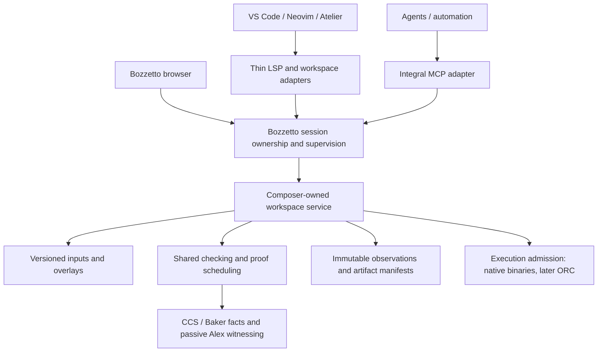

# Integrated editor workspace direction and review checkpoint

September 30, 2026. Design checkpoint for the coordinating auditor; no runtime implementation or deployment change. This extends the [development plan](Clef_Composer_Development_Plan.md) after reviewing Lattice, Neovim and Atelier.

## Decision: integration and self-hosting lead

Build one authoritative Composer workspace per explicitly selected session, supervised by Bozzetto and shared by editors, humans and agents. Its compiler state, scheduling, evidence and execution admission should survive changes in frontend and transport. Ionide is vestigial migration context. Existing Lattice scaffolding and Atelier assumptions that predate Bozzetto impose no architectural requirement.

Retain useful implementation where it serves this design: source grammar ownership, stale-response rejection, compiler-owned proof projections and editor integration. Consolidate duplicated checking and scheduling behind the compiler service. LSP provides standard editor interoperability; it need not carry every graph, observation or execution operation. MCP remains an integral, supported interface to the same authority. Rich clients can use explicit workspace operations and subscriptions directly.

This direction adds no requirement for Ionide, FSAC, FSI, Harmony, Fantomas or a managed editor framework to Clef workspace semantics. Today's managed compiler is the bootstrap implementation. Versioned contracts and process isolation should let a native implementation replace it without rewriting every client.

## What exists

| Surface | Inspected implementation | Remaining integration |
|---|---|---|
| Bozzetto | MCP and human HTTP/browser interfaces share a supervised Composer worker, edit reservations, accepted-artifact metadata and gated native execution. The [independent incremental audit](Bozzetto_Incremental_Workflow_Auditor_Assessment_2026-09-30.md) exercised cold, unchanged and edited builds. | Shared editor checking/overlays, full artifact inventory, compiler-stage events and ORC. |
| Lattice / VS Code | Active `client/` connects one Clef stdio language client; syntax grammar, diagnostics, hover, definitions and a proof TreeView. Stale document/check results and navigation tickets are rejected. | No integrated Bozzetto workspace, MLIR/LLVM clients, exact-byte artifact editor or graph renderer. Inherited `src/` and `release/` are reference material. |
| Lattice / Neovim | Initial Clef client on Neovim's built-in LSP, explicit server command and `.fidproj` roots. | Shared Bozzetto authority, proof/artifact views and interactive Clef execution. Existing fixture tests do not establish a native CCS workflow. |
| Atelier | Design repository: native Clef host, CodeMirror, Dockview, D3, terminal and semantic/proof panes are proposed. | Application implementation has not begun. BAREWire, reflection and native REPL integration remain design work. |

Sources: [Lattice vision](../../lattice-vscode/docs/Compiler_Workspace_Vision.md), [active extension](../../lattice-vscode/client/extension.cjs), [proof view](../../lattice-vscode/client/proof-view.cjs), [Neovim status](../../lattice-vim/README.md), [Atelier status](../../Atelier/README.md).

The important missing integration is below the displays. Lattice currently creates its own [EditorSession](../../Composer/src/Lattice.Server/Server.fs), which checks through [CCS.Editor](../../Composer/src/CCS.Editor/Session.fs). Bozzetto uses Composer's `ProjectSession` in its worker. Opening the same project path does not make these one workspace or make their revisions interchangeable. Composer's [integration plan](../../Composer/docs/Lattice_Integration.md) already identifies reuse of checking, scheduling and publication behind adapters as required work.

## Target authority and ownership

The following is the proposed end state, not a diagram of deployed components. The shared editor/compiler service and its attach operations still need implementation.

Bozzetto owns worker lifetime, connection routing and session coordination. Composer/CCS owns semantic state, source snapshots, proof work, publication and execution admission. Preserve isolation where compiler state is process-global. The initial handoff's `ProjectSession` boundary remains in force until Composer supplies the shared service; attaching another direct CCS caller to the worker would not implement this consolidation safely.

Extend the existing provider boundary with the necessary workspace operations instead of creating another general-purpose orchestration framework. Each attached client identifies the owning host, session, epoch, project and target. Independent sessions remain possible and explicitly distinct. A later standalone Composer MCP host reuses these semantics; an attach operation routes to the existing owner instead of silently reopening the project.

### Editing and source identity

The workspace must own ordered project inputs, configuration/dependency identities and immutable source snapshots, including unsaved overlays when supported. Compiler checks and a requested build must consume the same identified inputs. Editor document version, LSP check generation, Bozzetto adapter revision, Composer generation, compiler epoch and PSG revision remain distinct, with explicit relationships. Overlay updates carry their expected base workspace revision and client/document identity. Conflicting concurrent edits require an explicit refusal or reconciliation; one editor's locally valid document version cannot silently overwrite another editor's admitted input.

Today the provider builds file-backed inputs. Its successful reservation precedes source writes and withdraws execution authority. LSP `didChange` alone cannot provide a pre-write reservation or prove that an unsaved buffer matches the accepted build. Start with an explicit reserve/save/build integration. Add unsaved-buffer execution only through a compiler-owned overlay transaction that invalidates the prior authority before admitting the new snapshot. Label buffer, saved and accepted revisions separately during this transition. If bootstrap builds materialize overlays externally, record that exact snapshot and its complete inputs; do not overwrite the user's checkout to imitate an overlay.

### Efficient near-real-time operation

Keep local lexical feedback immediate and let the shared service coalesce obsolete semantic requests. Reuse the existing scheduling work where suitable, with bounded queues for checking, proof dispatch and native work. Requests from multiple clients for the same snapshot should share compiler work. Detaching one observer must not accidentally cancel work still needed by another; explicit workspace cancellation remains an authority operation.

Publish progressive evidence only where the compiler supports it. Inspection of an existing snapshot should not launch another build or solver job. Status, invalidation and cancellation remain responsive during expensive work. Viewport interest may prioritize work; it cannot declare an unchecked result current or narrow proof dependencies.

Measure edit-to-first-current-result and edit-to-complete-evidence, cold and warm, with p50/p95 over a declared edit workload. Separate queue, checking, solver, native build, transport and rendering costs; count duplicated checks, retained work, memory and backlog. Use correlated timing spans with explicit clock provenance. Establish baseline measurements, then fix latency budgets and workload before claiming responsiveness acceptance. A debounce setting, smooth animation or zero witness visits is not a latency result.

## One evidence contract, several presentations

The first visible integration should expose a compiler-produced artifact inventory through both MCP and an editor panel attached to the same Bozzetto session. The current [provider receipt](../Bozzetto.Composer/ProviderContracts.fs) includes source/executable identity, object manifests and witness/object work counters. It does not yet inventory every MLIR, LLVM IR, query or certificate artifact.

Proposed observation/manifest fields include:

- Owning authority, compiler distribution identity, project/target and explicit source, check, graph and build identities.
- Artifact kind, stage, producer, original content hash and available exact bytes; missing stages are explicit.
- Compiler-authored source span → PSG node/occurrence → witness → lowered operation correspondence, preserving multiplicity and missing links.
- Separate freshness, source-proof verdict, witness status, object reuse, artifact acceptance and independently checked certificate results. Certificate records identify the exact query/certificate bytes and checker/options.

Preserve originals. Formatting creates a labelled derivative with its own provenance; it never silently replaces checker inputs. Syntax highlighting, parsing, a source solver verdict and successful execution establish different facts. Older snapshots can remain inspectable with their identity visible; execution still passes through the current compiler gate.

Use VS Code's native panels or documents and Neovim buffers/status views first. A shared browser graph can complement Neovim without requiring a VS Code WebView API. Atelier can later consume the same observations in richer panes. Its [CodeMirror/Lezer plan](../../Atelier/docs/07_lezer_parsing.md) supports local lexical/syntax feedback; compiler semantics remain with CCS.

MLIR's official service supports diagnostics, navigation and other language features for registered dialects; validate it against the actual emitted artifacts. It is an artifact-language service, not the owner of Clef source meaning or admission. LLVM IR support needs separate selection and validation. SMT-LIB and certificate formats need appropriate readers and checkers. No inherited formatter is a prerequisite. See the [official MLIR LSP documentation](https://mlir.llvm.org/docs/Tools/MLIRLSP/) and [Lattice's artifact proposal](../../lattice-vscode/docs/Compiler_Workspace_Vision.md).

## Incremental hypergraph and proof activity

The Lattice visual direction is useful: stable spatial regions, depth, a controllable camera and brief illumination of actual compiler activity. D3 is a prototype candidate; Cytoscape supplies another graph/layout reference. They are replaceable presentation choices. [D3 transitions](https://d3js.org/d3-transition) and [Cytoscape.js](https://js.cytoscape.org/) document the relevant rendering facilities. This checkpoint interprets the cvc5 reference as proof activity/evidence; using the [SMT solver](https://cvc5.github.io/docs/latest/index.html) to solve visual layout constraints would be a separate optional experiment. Compiler memory-layout constraints and screen coordinates have different purposes.

The published [PSG revision](../../Fidelity.PSG/src/Fidelity.PSG/Revision.fs) already carries nodes, edges, codata, emissions, obligations and exact queries. That in-memory schema is not yet a complete external workspace stream. Preserve ordered hyperedge sources, target, class, role and ordinal, plus occurrence grouping. A renderer based on binary edges can use explicit junction/incidence nodes; arbitrary pairwise flattening loses meaning. [Node IDs](../../Fidelity.PSG/src/Fidelity.PSG/Identity.fs) are revision-local: matching integers or SSA spellings cannot establish continuity across revisions.

“The entire hypergraph” means complete navigable coverage with visible filtering/collapse, progressive detail and explicit unavailable regions. It need not mean drawing every node simultaneously. Retain camera and selection only where compiler-authored correspondence permits it. Visual coordinates remain client state and never become proof evidence.

Current `clef/proofsChanged` notifications invalidate/refresh proof views; Bozzetto's completed-operation notifications likewise do not constitute a detailed compiler-stage trace. Fine-grained animation needs compiler-authored revision-tagged events. Until then show honest snapshots. Event gaps, reconnect and overflow require snapshot resynchronization and an explicit incomplete-history indication. Preserve event order/timing separately from animation; include pause/replay, reduced motion, persistent state markers and keyboard/text access.

Show invalidated, running, source verdict, witnessed, object reused and accepted as distinct states. Complete-use dependencies include relevant absence and membership facts, roles/order, captures, shared claims and compiler/target policy. Generic graph reachability or identical SMT bytes is insufficient for selective proof reuse. Preserve full source and MLIR proof revalidation until the compiler establishes complete dependency authority. The [proof composition contract](../../Composer/docs/Proof_Composition_Architecture.md) owns that work; the viewer cannot infer it from retained objects.

## Atelier and the self-hosting path

Atelier's [reflection direction](../../Atelier/docs/11_native_reflection.md) fits a resident, versioned compiler workspace. Its older SageFS bootstrap assumption should map to the Bozzetto/Composer boundary for Clef; separate SageFS remains available for F# implementation work. Reflection, a particular actor topology and a native shell are not prerequisites for the first integrated loop.

The [agent-surface notes](../../Atelier/docs/knowledge-layer/08_agent_surface.md) describe MCP as optional and claim dimensional information cannot survive JSON. Those assumptions do not govern Bozzetto. Explicit structured fields can preserve dimensions, roles, identity and provenance. Native BAREWire transport can be evaluated when useful, while MCP remains supported. A typed binary format alone does not establish semantic or proof authority. Compiler facts, human-authored links, agent proposals and derived history retain distinct provenance.

Keep schemas independent of CLR names, reflection, SDK objects and editor libraries. Reuse portable conformance fixtures across the managed worker and a future native implementation. Native hosting must demonstrate the same edit, publication, refusal, retirement and observation behavior without a .NET runtime. Atelier's proposed F#/Fable frontend is also a bootstrap choice, not a dependency to propagate into workspace contracts. Rich local transport and reduced copying can follow measurements; no binary-transport rewrite is required to begin integration.

## Ordered implementation and auditor acceptance

1. **Shared workspace and the first editor loop.** Composer extracts/reuses the checking and proof scheduler behind a workspace API; Bozzetto extends its existing supervised provider. Attach VS Code or Neovim explicitly to that session, then reserve/save/build/run and inspect exact artifacts from a compiler manifest. Prove human/MCP/editor identity agreement, no duplicate checking for shared demand, pre-write withdrawal, stale-response rejection and current-artifact revalidation. Read-only artifact work can proceed alongside the service work, but does not alone close this milestone.
2. **Unsaved edits and measured responsiveness.** Add immutable overlay transactions and compiler-supported progressive observations. Exercise rapid edits, dependency/target changes, conflicting concurrent edits from the same base revision, one observer disconnecting, cancellation, reconnect and worker replacement. Require matching checked/build inputs, explicit conflict handling, bounded queues/resources and no superseded publication. Record latency distributions and actual work counts; retain full proof checks.
3. **Linked graph/proof/IR prototype.** Obtain the compiler export, correspondence and event coverage required for one edited region plus retained/shared regions. Validate hyperedge roles, stale-event handling, incomplete-history recovery, exact hashes and stable navigation. Integrate MLIR services; select LLVM support separately. Atelier can reuse the contracts when its host is ready. Large-graph scaling and certificate verification have their own evidence.
4. **Native host and REPL progression.** Replace managed hosting behind the same contract as compiler readiness permits; keep this migration active throughout earlier steps. Composer's [workbench plan](../../Composer/docs/Interactive_Compiler_Workbench.md) owns ORC materialization, publication, state/callback lifetime and retirement. `clefx`/`.clefx` remain planned. Native host migration and ORC can progress independently; neither expands current accepted-binary execution claims.

The auditor should assess consolidation ownership, overlay/authority semantics, proof-dependency boundaries and measured efficiency before broad frontend implementation. This checkpoint itself ran no builds, tests, server probes or deployment operations. It preserves the live provider and the compiler agent's work lease. A new compiler distribution still needs explicit promotion and acceptance against its digest.

## Inspection provenance

| Repository | Inspected HEAD | Working-tree caveat |
|---|---|---|
| Bozzetto | `2cd3fc3c` | Clean before this documentation change. |
| lattice-vscode | `237c4db9` | README/proof-view/test edits and untracked docs included in review. |
| lattice-vim | `06450f0c` | Clean. |
| Atelier | `83f79b6f` | Transcription/reflection drafts modified. |
| Composer | `f4c48e66` | Active compiler edits; not the deployed compiler identity. |
| clef | `4c19bd57` | Active edits. |
| Fidelity.PSG | `1c6b3327` | Active edits. |

Selected source bytes, SHA-256 values, full HEADs and status records are preserved outside repositories at `~/.local/state/bozzetto/planning/2026-09-30-editor-workspace/20260930T180900Z/manifest.json` and its adjacent `inputs/`. These are planning provenance, not runtime acceptance. Other repositories and their pending edits were left untouched. The deployed compiler identity and demonstrated limits remain those in the independent incremental assessment.
